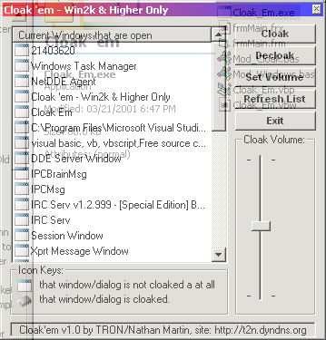



## Cloak 'em \- A Dialog Transparenter \[Update 1\]

### Description

Cloak Windows and Dialogs by selecting them in a list and this project also shows you which windows and dialogs that are already cloaked. :)

Cloak as in transparented and you can set the volume of the cloak(how much is transparented) Note: Just like all other transparent code on PSC, this can only work on Windows 2000 or Higher(And not WinME either! ;) [I have updated the source code, add more comments and code to make it even better for those who were kinda lost at first and I also fixed a few typos that I did on the GUI next to the first Icon at the bottom there, oops ;)]
 
### More Info
 
This only works on Windows 2000 Operating Systems and higher( and Not WinME either!)

After running this project it may cause some memory problems, depending on how much memory you have and how fast your CPU is, don't worry it doesn't cause this, it's just how Windows 2000 is.

             |
---                |---
**Submitted On**   |2001-03-22 11:44:38
**By**             |[TRON](https://github.com/Planet-Source-Code/PSCIndex/blob/master/ByAuthor/tron.md)
**Level**          |Intermediate
**User Rating**    |5.0 (15 globes from 3 users)
**Compatibility**  |VB 5\.0, VB 6\.0
**Category**       |[Graphics](https://github.com/Planet-Source-Code/PSCIndex/blob/master/ByCategory/graphics__1-46.md)
**World**          |[Visual Basic](https://github.com/Planet-Source-Code/PSCIndex/blob/master/ByWorld/visual-basic.md)
**Archive File**   |[CODE\_UPLOAD174243222001\.zip](https://github.com/Planet-Source-Code/tron-cloak-em-a-dialog-transparenter-update-1__1-21837/archive/master.zip)

